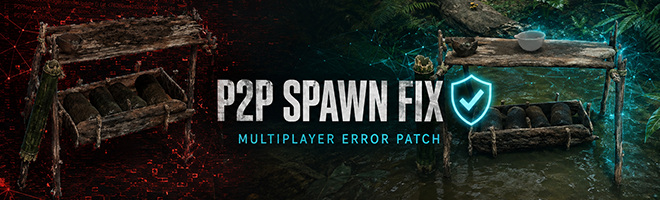

# P2P Spawn Fix — Beta

P2P Spawn Fix is a targeted multiplayer stability patch for Green Hell.

It repairs a specific replication failure where an object-spawn message arrives with a null or zero-byte payload. Without the patch, this can trigger repeated exceptions in `P2PObjectSpawnMessage.Deserialize`, `ReplicationComponent.Deserialize`, or `ReplicatedPlayerSubelements.OnReplicationResolve`.

## What it fixes

- Replaces null spawn-data arrays only while a P2P object-spawn message is being deserialized.
- Skips impossible zero-byte initial replication states before the network reader goes out of range.
- Rebuilds missing replicated-player subelement state when it can be recovered safely.
- Uses rate-limited diagnostic messages to avoid flooding the Unity log.
- Loads automatically with the game as a permanent mod.

## Installation and use

Install the `.ghmod` normally through the Green Hell ModLoader. The correction is automatic and does not require configuration.

For consistent co-op behavior, install it on the host and on all affected players. In the console, run:

```text
p2pfix status
```

This displays the number of repaired or blocked network states.

## Beta scope

This Beta targets the reported P2P spawn/replication stack only. It does not repair unrelated missing-prefab, missing-script, AI-group, or Event System warnings.

Compatibility is intentionally capped at Green Hell Update 1.5.5 until later game versions are tested.

## Version 1.2.2

- Corrected null spawn-data handling.
- Added protection against zero-byte initial replication reads.
- Added recovery for missing replicated-player subelement state.
- Added the `p2pfix status` diagnostic command.
- Marked the mod as permanent so it loads with the game.
- Added unique icon and banner artwork.

## License

Licensed under the GNU Affero General Public License v3.0. See [LICENSE](LICENSE).